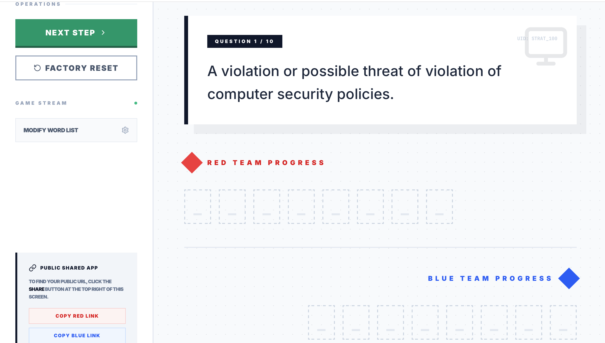
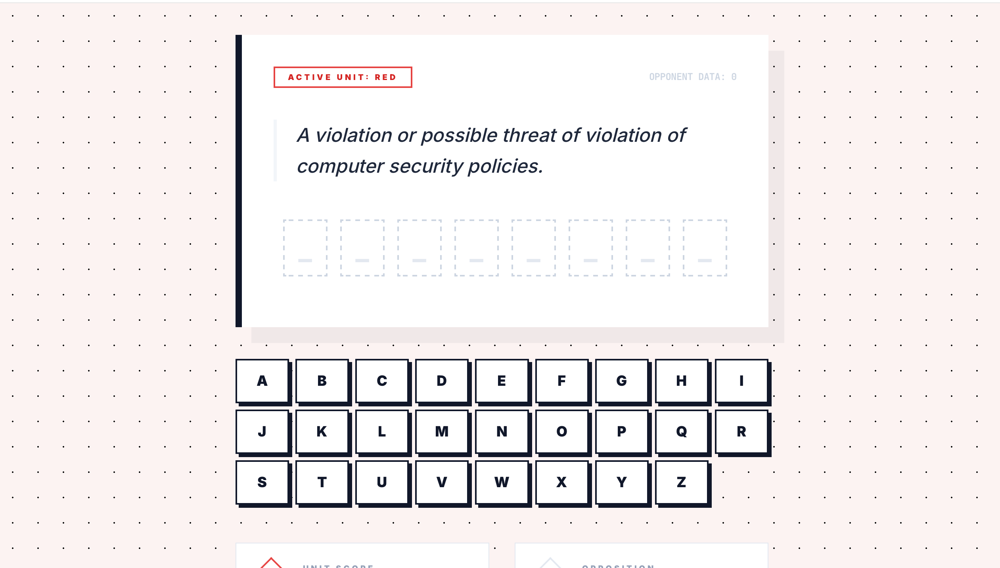
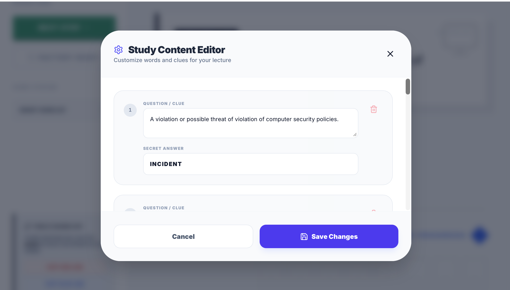

# Stratagem: Performance Simulation

Stratagem is a high-stakes, real-time classroom competition interface designed for technical unit simulations. It transforms traditional quizzes into a fast-paced "word-guessing" race where teams compete to validate system components based on technical clues.

## The Activity: Strategic Component Validation

**Objective:** Be the first team to uncover the "Secret Answer" for each technical clue provided by the Host.

**How it works:**
1. **The Briefing:** The Host (Teacher) initializes the simulation from the Master Terminal.
2. **The Sync:** Students join either the **Red Unit** or **Blue Unit** by scanning a unique QR code displayed on the main screen.
3. **The Race:** A technical clue appears on the screen. Teams must use their collective knowledge to identify the missing word.
4. **Validation:** Team members tap letters on their individual devices to uncover the word. If a team member taps a correct letter, it reveals for the entire team in real-time.
5. **Scoring:** The first unit to complete the word wins the point for that round.
6. **Persistence:** The Host advances the simulation through multiple phases until a victor is declared.

---

## Interface Descriptions

### 1. Dashboard Host (The Master Terminal)

*The centralized command center for game orchestration.*

The Host view is a centralized command center designed for large-screen projection. 
- **Balanced Scoreboard:** A dual-sided header showing real-time scores for Red and Blue units with bold, geometric typography.
- **Operations Sidebar:** Contains controls to "Initialize" the game, move to the "Next Step," or perform a "Factory Reset."
- **Game Stream:** A real-time monitoring area where the Host can see exactly which letters each team has uncovered as they type.

### 2. Red Unit / Blue Unit (Tactical Interfaces)

  
  

*Mobile-optimized terminals for unit participants.*

Student devices transform into specialized tactical terminals once they scan into a team.
- **Active Unit Status:** Clear color-coded feedback (Red or Blue) ensures every student knows which unit they represent.
- **The Word Matrix:** A series of underscore blocks that fill in with bold letters as the team correctly identifies characters.
- **Tactical Keyboard:** A full A-Z keyboard for letter input. Correct guesses reveal the letter; incorrect guesses trigger a visual "shake" feedback.

### 3. Content Configuration (Edit System)

*The modular input system for custom simulation data.*

The Host can customize the academic content to fit any subject matter.
- **Study Content Editor:** A modal accessible from the host sidebar.
- **Secret Answer Entry:** Define the target word (automatically sanitized to uppercase/A-Z).
- **Sequence Management:** Add, remove, or reorder questions to build a custom simulation "deck."

---

## Technical Specifications
- **Design Aesthetic:** Swiss Architectural / Geometric Balance (Bold typography, high contrast, modular spacing).
- **Real-time Sync:** Powered by Firebase Firestore for millisecond-latency updates across all connected devices.
- **Responsive Layout:** Optimized for desktop projection (Host) and mobile-first touch interfaces (Teams).
